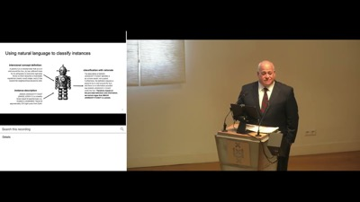
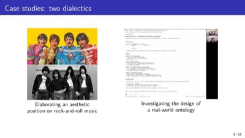
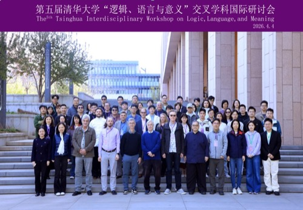
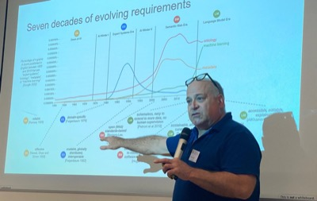
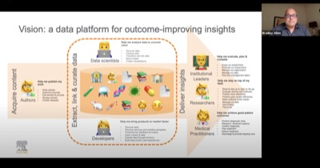
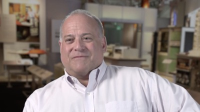

# Bradley P. Allen

Researcher, Intelligent Data Engineering Lab (INDE Lab), Informatics Institute, University of Amsterdam

[Email](mailto:b.p.allen@uva.nl) · [CV](resources/Bradley_Allen_CV.pdf) · [Google Scholar](https://scholar.google.com/citations?hl=en&user=cdQ_HrAAAAAJ) · [ORCID](https://orcid.org/0000-0003-0216-3930) · [PhilPapers](https://philpeople.org/profiles/bradley-allen) · [GitHub](https://github.com/bradleypallen/) · [LinkedIn](https://www.linkedin.com/in/bpallen)

## Background

I began my career in 1982 as a Senior Research Programmer at Carnegie Mellon University's Robotics Institute. In 1984, I became one of the first knowledge engineers of the expert-systems era at Inference Corporation, where I helped build the ART expert system development environment. I went on to serve as Founder and CTO of three startups (Limbex, TriVida, and Siderean) and as Chief Architect at Elsevier. After forty years in industry, I have returned to academic research at the University of Amsterdam's Intelligent Data Engineering Lab (INDE Lab). I hold a PhD in Computer Science from the University of Amsterdam and a BS in Applied Mathematics (Computer Science) from Carnegie Mellon University.

## Research

My work treats knowledge engineering as explicitation: making expert practice explicit, in forms that can be reasoned with, evaluated, and answered for. This recasts a problem I have worked on my entire career — from the rule-based expert systems of the 1980s to the large language models of today — as one continuous question: how to build systems whose assertions carry genuine commitments, for which the people who deploy them can be accountable.

I've shown that large language models can use natural-language definitions of concepts and roles to evaluate knowledge graphs, articulate rationales that surface factual and metalinguistic errors, and self-report bilateral doxastic states that enable sound and complete paraconsistent reasoning even when their beliefs are inconsistent.

Currently working on:

- structured human–LLM dialogue protocols for collaborative knowledge base construction
- bilateral modal logics for reasoning about LLM beliefs
- methodologies for probing LLM endorsement of material inferential rules

## Recent Talks & Media

-  **Knowledge engineering with large language models** — interview, Weaviate Podcast #139, 1 June 2026. [Video](https://www.youtube.com/watch?v=xY_SqvhArNQ)
-  **PhD thesis defense layman's talk** — University of Amsterdam, 30 April 2026. [Video](https://www.youtube.com/watch?v=PXXw8jSE6I0) · [Slides](resources/Allen_PhD_Defence_Laymans_Talk.pdf)
-  **Elenchus: Generating Knowledge Bases from Prover–Skeptic Dialogues** — invited talk, Commonsense AI group, Vrije Universiteit Amsterdam, 29 April 2026. [Slides](resources/Allen_Elenchus_VU_talk.pdf)
-  **BBL: A Bilateral Modal Logic for LLM Factuality Evaluation** — TLLM 2026, Tsinghua University, 3 April 2026. [Slides](resources/Allen_TLLM_2026_slides.pdf)
-  **A Brief History of Knowledge Engineering: A Practitioner’s Perspective** — invited talk, Dagstuhl Seminar, 12 September 2022. [Dagstuhl Reports](https://drops.dagstuhl.de/storage/04dagstuhl-reports/volume12/issue09/22372/DagRep.12.9.60/DagRep.12.9.60.pdf#page=6)
-  **Data science in practice at Elsevier** — Harvard Data Science Initiative Industry Seminar, 15 September 2020. [Video](https://www.youtube.com/watch?v=cK3yKFhDyxs)
-  **Oral History of Brad Allen** — Computer History Museum, 16 May 2018. [Video](https://www.youtube.com/watch?v=2yKJ1CA9FYU) · [Transcript](https://archive.computerhistory.org/resources/access/text/2020/04/102740341-05-01-acc.pdf)

## Selected Publications

- [**Neurosymbolic Knowledge Engineering with Natural Language.**](https://dare.uva.nl/personal/search?identifier=30baa328-ff48-47de-bb9c-7787ee2f7e34) Bradley P. Allen. PhD thesis, University of Amsterdam, 2026.
- [**Conceptual Engineering Using Large Language Models.**](https://doi.org/10.1007/978-3-032-10073-3_1) Bradley P. Allen. In Vincent C. Müller, Leonard Dung, Guido Löhr, and Aliya Rumana, editors, *Philosophy of Artificial Intelligence*, Synthese Library, vol. 533. Springer, Cham, 2026.
- [**Elenchus: Generating Knowledge Bases from Prover–Skeptic Dialogues.**](https://arxiv.org/abs/2603.06974) Bradley P. Allen. arXiv:2603.06974, 2026.
- [**Sound and Complete Neurosymbolic Reasoning with LLM-Grounded Interpretations.**](https://arxiv.org/pdf/2507.09751) Bradley P. Allen, Prateek Chhikara, Thomas Macaulay Ferguson, Filip Ilievski, and Paul Groth. *Proceedings of the 19th International Conference on Neurosymbolic Learning and Reasoning (NeSy 2025)*, PMLR 284:392–419, 2025.
- [**A Benchmark for the Detection of Metalinguistic Disagreements between LLMs and Knowledge Graphs.**](https://ceur-ws.org/Vol-3953/356.pdf) Bradley P. Allen and Paul Groth. *Special Session on Harmonising Generative AI and Semantic Web Technologies (HGAIS 2024)*, CEUR Workshop Proceedings 3953, 2025.
- [**Large Language Models and the Relative Roles of Formal and Natural Language in Formalization.**](https://philpapers.org/archive/ALLLLM.pdf) Bradley P. Allen. Preprint, 2025.
- [**Carnap's Robot Redux: LLMs, Intensional Semantics, and the Implementation Problem in Conceptual Engineering.**](https://philarchive.org/rec/ALLCRR-2) Bradley P. Allen. Preprint, 2024.
- [**SHROOM-INDElab at SemEval-2024 Task 6: Zero- and Few-Shot LLM-Based Classification for Hallucination Detection.**](https://aclanthology.org/2024.semeval-1.120/) Bradley P. Allen, Fina Polat, and Paul Groth. *Proceedings of the 18th International Workshop on Semantic Evaluation (SemEval-2024)*, ACL, 2024.
- [**Evaluating Class Membership Relations in Knowledge Graphs using Large Language Models.**](https://doi.org/10.1007/978-3-031-78952-6_2) Bradley P. Allen and Paul Groth. *The Semantic Web: ESWC 2024 Satellite Events*, LNCS 15344, Springer, 2025.
- [**Standardizing Knowledge Engineering Practices with a Reference Architecture.**](https://doi.org/10.4230/TGDK.2.1.5) Bradley P. Allen and Filip Ilievski. *Transactions on Graph Data and Knowledge*, 2(1):5:1–5:23, 2024.
- [**Identifying and Consolidating Knowledge Engineering Requirements.**](https://arxiv.org/abs/2306.15124) Bradley P. Allen, Filip Ilievski, and Saurav Joshi. arXiv:2306.15124, 2023.
- [**Knowledge Engineering using Large Language Models.**](https://doi.org/10.4230/TGDK.1.1.3) Bradley P. Allen, Lise Stork, and Paul Groth. *Transactions on Graph Data and Knowledge*, 1(1):3:1–3:19, 2023.
- [**Knowledge Engineering with Language Models and Neural Methods.**](https://drops.dagstuhl.de/storage/04dagstuhl-reports/volume12/issue09/22372/DagRep.12.9.60/DagRep.12.9.60.pdf#page=34) Elena Simperl, Paul Groth, Steffen Staab, Marta Sabou, Eva Blomqvist, and Bradley P. Allen. *Dagstuhl Reports*, 12(9):93–96, 2023.
- [**A Brief History of Knowledge Engineering: A Practitioner’s Perspective.**](https://drops.dagstuhl.de/storage/04dagstuhl-reports/volume12/issue09/22372/DagRep.12.9.60/DagRep.12.9.60.pdf#page=6) Bradley P. Allen. *Dagstuhl Reports*, 12(9):65–72, 2023.
- [**Case-Based Reasoning: Business Applications.**](https://doi.org/10.1145/175247.175250) Bradley P. Allen. *Communications of the ACM*, 37(3):40–43, 1994.
- [**A Knowledge-Based Environment for the Development of Software Parts Composition Systems.**](https://doi.org/10.1145/74587.74602) Bradley P. Allen and S. Daniel Lee. *11th International Conference on Software Engineering (ICSE)*, pages 104–112, 1989.
- [**Job-Shop Scheduling: An Investigation in Constraint-Directed Reasoning.**](https://cdn.aaai.org/AAAI/1982/AAAI82-037.pdf) Mark S. Fox, Bradley P. Allen, and Gary Strohm. *AAAI*, pages 155–158, 1982.

*1,340 citations · h-index 15 · i10-index 16 (Google Scholar, June 2026).*

[Full publication list on Google Scholar →](https://scholar.google.com/citations?hl=en&user=cdQ_HrAAAAAJ)

---

*Copyright © 2026 Bradley P. Allen.*
