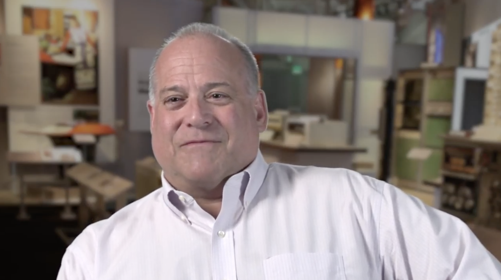
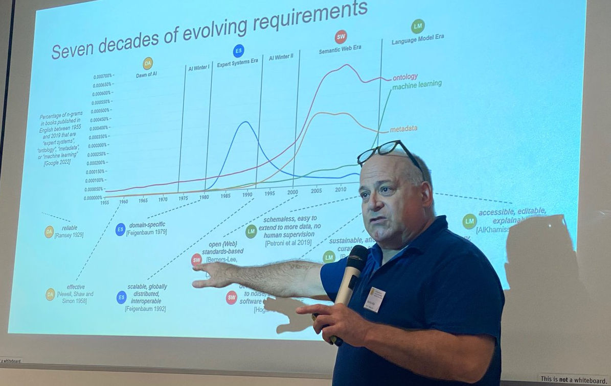
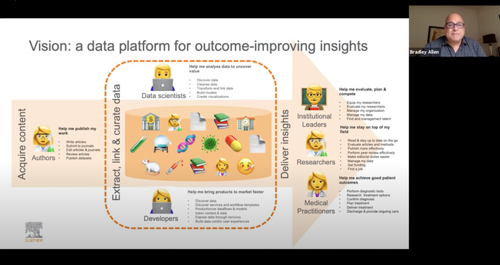

# Bradley P. Allen

|  | I'm [**a technology executive and serial entrepreneur**](https://www.linkedin.com/in/bpallen) who is currently [**a doctoral candidate in the University of Amsterdam's Intelligent Data Engineering Lab**](https://indelab.org/). Previously, I was Chief Architect at Elsevier, and before that, founder/CTO at three startups in the Los Angeles area, achieving successful exits in two of the three. I began my career during the 1980s as [**one of the very first knowledge engineers of the expert systems era**](https://archive.computerhistory.org/resources/access/text/2020/04/102740341-05-01-acc.pdf), after earning a BS in Applied Mathematics at Carnegie Mellon University.  |
| - | - |
|  |  My research at INDE lab explores [**knowledge engineering using large language models**](https://drops.dagstuhl.de/storage/08tgdk/tgdk-vol001/tgdk-vol001-issue001/TGDK.1.1.3/TGDK.1.1.3.pdf). A specific focus has been on [**the application of LLMs as cognitive tools for the philosophical practice of conceptual engineering**](https://philpapers.org/rec/ALLCEU) and how that provides insights towards framing a foundation for hybrid intelligence in the twenty-first century. | 
|  | A major part of my commercial work was as [**an architect of data platforms for business transformation**](https://www.youtube.com/watch?v=cK3yKFhDyxs). In this presentation to the Harvard Data Science Initiative in September 2020, I discuss data science in practice at Elsevier, detailing the business motivations, the organization, and how data science over scientific content and data led to the delivery of new products to Elsevier's customers. |
|  | I am at various other times [**an amateur astronomer, a mountaineer, and a home cook**](https://twitter.com/bradleypallen/status/1344834635864231936). Of late, there's been a bit more of the third of these activities than the other two. Here I am unmolding my version of a timpano, inspired (as so many others) by the one featured in Stanley Tucci's film "Big Night". |

*Copyright &copy; 2025 Bradley P. Allen. All rights reserved.*
