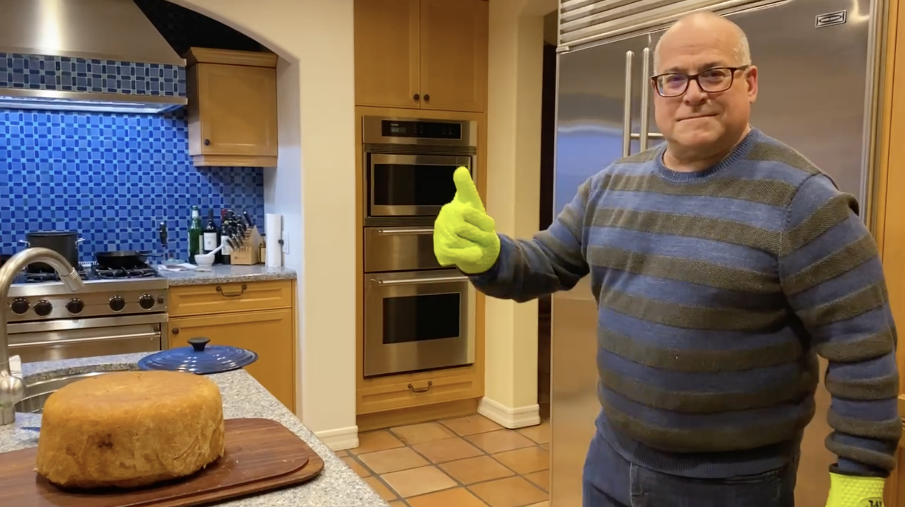

# Bradley P. Allen

|  | I'm [**a technology executive and serial entrepreneur**](https://www.linkedin.com/in/bpallen) who is currently Chief Architect at Merit, a Bay Area startup building a verified identity platform. Previously, I was Chief Architect at Elsevier, and before that, founder/CTO at three startups in the Los Angeles area, achieving successful exits in two of the three. I began my career during the 1980s as [**one of the very first knowledge engineers of the expert systems era**](https://archive.computerhistory.org/resources/access/text/2020/04/102740341-05-01-acc.pdf), after earning a BS in Applied Mathematics at Carnegie Mellon University.  |
| - | - |
|  | I am also [**a Guest Researcher in the INtelligent Data Engineering Lab at the University of Amsterdam**](https://indelab.org/). At INDE Lab, I am exploring the evolution of the practice of knowledge engineering and the impact of large language models on that evolution. | 
|  | A major part of my work is as [**an architect of data platforms for business transformation**](https://www.youtube.com/watch?v=cK3yKFhDyxs). In this presentation to the Harvard Data Science Initiative in September 2020, I discuss data science in practice at Elsevier, detailing the business motivations, the organization, and how data science over scientific content and data is enabling the delivery of new products to Elsevier's customers. |
|  | I am also [**a developer of commercial applications of machine learning**](https://www.youtube.com/watch?v=rZYpHD5wktg). At this LA Machine Learning Meetup event in February 2019, I discuss work with my Elsevier colleagues towards the use of machine learning to analyze scientific and medical content. |
|  | My focus on these areas also has application to my personal interests as [**a book collector specializing in the works of William S. Burroughs**](https://wsburroughs.link/), the American Beat Generation author. In this talk at the 2019 LD4 Conference on Linked Data in Libraries in May 2019, I describe my use of library linked open data standards to publish scholarly bibliographical data about my collection. |
|  | I am at various other times [**an amateur astronomer, a mountaineer, and a home cook**](https://twitter.com/bradleypallen/status/1344834635864231936). Of late, there's been a bit more of the third of these activities than the other two. Here I am unmolding my version of a timpano, inspired (as so many others) by the one featured in Stanley Tucci's film "Big Night". |

*Copyright &copy; 2023 Bradley P. Allen. All rights reserved.*
